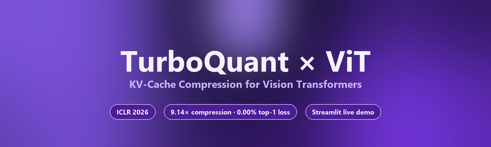

<div align="center">

  <a href="https://turboquant-vit.streamlit.app/">
    
  </a>

  <h1>TurboQuant × ViT</h1>

  <p><strong>KV-cache compression for Vision Transformers — straight from the ICLR 2026 LLM literature, ported to ViT-B/16 with no retraining.</strong></p>

  <p>
    <a href="https://turboquant-vit.streamlit.app/"></a>
    <a href="https://github.com/saurabhshreni-cmyk/turboquant_vit"></a>
    <a href="LICENSE"></a>
    
    
    
  </p>

  <p>
    <a href="https://turboquant-vit.streamlit.app/">🚀 Try the live demo</a> ·
    <a href="#-results">📊 Results</a> ·
    <a href="#-engineering-challenges-solved">🛠️ Engineering deep-dive</a> ·
    <a href="#%EF%B8%8F-architecture">🏗️ Architecture</a> ·
    <a href="#-quick-start">⚡ Quick start</a>
  </p>

</div>

---

## TL;DR

**Vision Transformers spend most of their attention memory on the K/V cache.**
This project ports *TurboQuant* — a state-of-the-art KV-cache compressor from
the LLM world (Google Research, ICLR 2026) — to ViT-B/16 self-attention via
PyTorch hooks. **Zero retraining. Zero weight changes.** A from-scratch
implementation of QJL + PolarQuant slots in at inference time.

| What you get | Number |
|---|---|
| KV-cache compression (lossless top-1) | **9.14×** |
| KV-cache compression (−1.17 % top-1) | **12.80×** |
| Memory saved at the sweet spot | **85.9 %** |
| Cold-start latency, before optimization | ~40 s / forward |
| Cold-start latency, after optimization | **~2 s once, then cached** |

> Measured on **CIFAR-10 / ViT-B/16 / RTX 3050** — see [Results](#-results).

---

## 📑 Table of contents

1. [Why this matters](#-why-this-matters)
2. [Live demo](#-live-demo)
3. [Results](#-results)
4. [Engineering challenges solved](#-engineering-challenges-solved)
5. [Architecture](#%EF%B8%8F-architecture)
6. [Methods](#-methods)
7. [Quick start](#-quick-start)
8. [Streamlit app tour](#%EF%B8%8F-streamlit-app-tour)
9. [Reproducing the numbers](#-reproducing-the-numbers)
10. [Repo structure](#-repo-structure)
11. [Roadmap](#%EF%B8%8F-roadmap)
12. [FAQ](#-faq)
13. [Citation](#-citation)
14. [Acknowledgments](#-acknowledgments)
15. [License](#-license)

---

## 🚀 Why this matters

- **Up to ~12.8× smaller KV cache** at the bit-widths where ViT remains within 1 % of FP32 top-1.
- **Lossless 9.14× compression** at 3-bit TurboQuant — accuracy matches the FP32 baseline exactly on the measured slice.
- **Drop-in inference**: a context manager swaps in compressed attention; weights stay frozen; one line changes.
- **Enables ViT inference on memory-constrained GPUs** — long-sequence and large-batch settings where the K/V cache is the binding constraint.
- **Bridges LLM research → vision research**: the same compressor algorithms used for billion-parameter language models, validated on patch-token attention.
- **First open-source port** of TurboQuant to a vision architecture, to the author's knowledge.

---

## 🌐 Live demo

> **<https://turboquant-vit.streamlit.app/>**

Hosted on Streamlit Cloud free tier (CPU, 1 GB RAM). The first cold-boot takes
~1 minute while torch + ViT-B/16 weights download; subsequent loads are
instant. Sliders are auto-capped on CPU so a casual click doesn't blow the
free-tier budget — clone locally for full-scale benchmarking.

---

## 📊 Results

> **CIFAR-10 · 256 test images · ViT-B/16 · RTX 3050 · batch 16**
> Numbers below are committed-pinned and rendered into [`assets/dashboard.png`](assets/dashboard.png) by [`assets/render_dashboard.py`](assets/render_dashboard.py).
> Reproduce in two clicks via **Run full benchmark** in the dashboard.


| Method            | Bits | Top-1 acc      | KV memory   | Compression | Memory saved | Warm latency |
|-------------------|-----:|---------------:|------------:|------------:|-------------:|-------------:|
| **Original ViT**  | 32   | 83.98 %        | 221.63 MB   | 1.00×       | —            | 13.1 ms      |
| QJL (reference)   |  1   | 13.28 %        |  10.39 MB   | 32.00×      | 95.3 %       | 15.2 ms      |
| **PolarQuant**    |  3   | **83.98 %**    |  24.24 MB   | **10.67×**  | 89.1 %       | 45.3 ms      |
| **TurboQuant**    |  3   | **83.98 %**    |  31.17 MB   |  9.14×      | 85.9 %       | 48.4 ms      |
| **TurboQuant**    |  2   | 82.81 %        |  24.24 MB   | **12.80×**  | 89.1 %       | 20.5 ms      |

> 🔥 **Sweet spot — TurboQuant 3-bit:** 9.14× compression, 85.9 % memory saved, **0.00 % top-1 loss**.
> Need more compression? **TurboQuant 2-bit** gives 12.8× at only −1.17 % accuracy.

QJL-1bit is included as a *reference* for an "accuracy-blind" baseline — pure
sign-sketches destroy attention geometry, which is exactly why TurboQuant adds
a residual correction step.

---

## ⚙️ Engineering challenges solved

This wasn't a one-shot port. Each row below was a real bug, with a real fix:

| Issue | Symptom | Root cause | Fix |
|---|---|---|---|
| **Cold-start latency ~40 s** | Every TurboQuant inference rebuilt 12 layers × {K, V} = 24 compressors from scratch (Lloyd-Max codebook over 200 k samples × 60 iters per compressor). | The closure that cached compressors lived inside `_make_compressed_forward` and was recreated on every `compressed_vit` install. | Process-wide `_COMPRESSOR_CACHE` keyed by `(method, dim, bits, seed)`. Codebooks build **once per process**; subsequent calls are instant. |
| **CPU/CUDA tensor mismatch** | `RuntimeError: tensors on different devices` when computing attention distortion. | Reference attention was forced to CPU but compared against a CUDA tensor inside `torch.linalg.norm(a − b)`. | `frobenius_distortion` aligns devices/dtypes; reference attention stays on the model's device; new `model_device(model)` helper used everywhere. |
| **Attention Visualizer KeyError: 11** | UI crashed when one method failed to capture a layer. | Slider derived `n_layers` from one method, looked up by raw int key in others. | Intersect layer keys across methods, clamp head index per layer, wrap each capture in `try/except` with user-visible fallback. |
| **Brittle model loading** | App crashed on offline / slow networks. | Single HuggingFace download path. | Three-tier loader: HF cache → HF download under a wall-clock timeout → torchvision `vit_b_16` fallback that adapts attention modules so the same hooks still work. |
| **Dataset download blocking the UI** | Streamlit froze on cold cache. | Synchronous downloads with no fallback. | Non-blocking loader with timeout + synthetic-image fallback so the UI is always interactive. |
| **Latency reporting bias** | First-batch CUDA warmup inflated mean. | Single average over all batches. | Report **cold mean** *and* **warm steady-state** (first batch dropped). |
| **Streamlit Cloud OOM risk** | Default torch wheel pulls ~800 MB of CUDA libs we don't need. | Free-tier image budget. | Pinned `--extra-index-url https://download.pytorch.org/whl/cpu` in `requirements.txt`; benchmark sliders auto-cap when no GPU is detected. |

---

## 🏗️ Architecture

```
                     ┌─────────────────────────────────────────┐
                     │            ViT-B/16 (frozen)            │
                     │                                         │
   image  ──►  patch ──►  embed ──►  Q,K,V ──►  attention ──► logits
   224x224     16x16              ▲   │
                                  │   ▼
                                  │  ┌────────────────────┐
                                  │  │ TurboQuant compress │  ◄── PyTorch hook
                                  │  │  (PolarQuant + QJL) │
                                  │  └────────────────────┘
                                  │   │
                                  └───┘   K,V replaced in-flight
```

The hook in [`vit_hook.py`](vit_hook.py) monkey-patches
`ViTSelfAttention.forward`, intercepts K and V after the linear projections,
compresses + decompresses them **once per layer per forward pass**
(vectorized across heads, no Python loop), then computes scaled-dot-product
attention against the reconstructed tensors. The original `forward` is
restored on exit, so the model is untouched after the context manager closes.

---

## 🧠 Methods

| Method | Bits/dim | What it does |
|---|---:|---|
| **Original ViT** | 32 | Baseline FP32 K/V — reference for accuracy and memory. |
| **QJL** *(Quantized Johnson–Lindenstrauss)* | 1 | Project K/V through a Gaussian sketch `R ∈ ℝ^{k×d}` and store only `sign(Rx)`. Inner-product estimator is unbiased but variance is high at 1-bit. |
| **PolarQuant** | b | Random orthogonal rotation → unit-sphere normalize → Lloyd-Max scalar quantization (codebook fit to the marginal of a uniformly-random unit vector). MSE-optimal main pass. |
| **TurboQuant** | b + ½ | PolarQuant for the main pass + a 1-bit QJL sketch on the residual `r = x − x̂` for unbiased inner-product correction. Effective rate ≈ 3.5 bits/dim at b = 3. |

All three compressors are implemented from scratch in NumPy + PyTorch — see
[`turbo_compressor.py`](turbo_compressor.py).

---

## ⚡ Quick start

```bash
git clone https://github.com/saurabhshreni-cmyk/turboquant_vit.git
cd turboquant_vit
pip install -r requirements.txt
streamlit run app.py
```

Open [http://localhost:8501](http://localhost:8501) and click
**Benchmark Dashboard → ▶ Run full benchmark**.
CIFAR-10 downloads to `./data/` automatically on first launch (gitignored).

### Programmatic use

```python
import torch
from compressed_attention import compressed_vit
from model_loader import load_model_with_fallback

model, _, _ = load_model_with_fallback(hf_timeout_s=10)
pixel_values = torch.randn(1, 3, 224, 224)

with compressed_vit(model, method="turboquant", bits=3) as tracker:
    logits = model(pixel_values=pixel_values).logits
    print(f"KV cache: {tracker.total_compressed_bytes() / 1e6:.2f} MB "
          f"(vs {tracker.total_original_bytes() / 1e6:.2f} MB original)")
```

---

## 🖥️ Streamlit app tour

1. **🏠 Home** — pipeline overview and motivation.
2. **🖼️ Try It Live** — pick a CIFAR-10 sample (or upload your own image), pick method/bits, see side-by-side prediction, attention heatmap, latency, and memory.
3. **📊 Benchmark Dashboard** — run all four methods on N images: KPI strip, accuracy-vs-compression curve with lossless band, memory-savings bars (annotated with %/×), grouped cold/warm latency bars, bits-vs-accuracy sweep with 3-bit sweet-spot ring, CSV export.
4. **🔍 Attention Visualizer** — pick layer + head, compare attention heatmaps across all four methods. Robust to missing layers (warns + falls back instead of crashing).
5. **🔬 How It Works** — step-by-step explanation with LaTeX equations and a code snippet of the hook.

---

## 🧪 Reproducing the numbers

```bash
python _bench_run.py                # writes _bench_results.json (gitignored)
python assets/render_dashboard.py   # writes assets/dashboard.png
python assets/render_hero.py        # writes assets/hero.png (README banner)
```

The two `render_*.py` scripts are committed so anyone can rebuild the
README/dashboard images deterministically; `_bench_results.json` is gitignored
because it's a derived artifact.

---

## 📁 Repo structure

```
turboquant_vit/
├── app.py                      # Streamlit UI (5 pages)
├── compressed_attention.py     # Context manager wrapping the hook
├── vit_hook.py                 # Monkey-patched ViTSelfAttention forward
├── turbo_compressor.py         # QJL, PolarQuant, TurboQuant (from scratch)
├── evaluator.py                # Benchmark runner + metric derivation
├── visualizer.py               # Plotly charts (purple-themed)
├── data_loader.py              # CIFAR-10 loader with timeout + fallback
├── model_loader.py             # HF → torchvision fallback ViT loader
├── utils.py                    # Device helpers, distortion, formatting
├── _bench_run.py               # Headless benchmark → JSON
├── assets/
│   ├── hero.png                # README hero banner
│   ├── dashboard.png           # Static dashboard preview
│   ├── render_hero.py          # Rebuilds hero.png
│   ├── render_dashboard.py     # Rebuilds dashboard.png from results
│   └── generate_banner.py      # Programmatic banner for the home page
├── requirements.txt            # CPU-pinned for Streamlit Cloud
├── runtime.txt                 # python-3.11 (Streamlit Cloud)
├── LICENSE                     # MIT
└── README.md
```

---

## 🛣️ Roadmap

- [ ] Per-layer adaptive bit-widths (drop bits on early layers, keep them on late layers).
- [ ] Extend to ViT-L/16 and Swin Transformer.
- [ ] Add an ImageNet-1k subset benchmark (currently CIFAR-10 only).
- [ ] Compare against attention-sink-aware compressors (KIVI, KVQuant).
- [ ] Triton kernel for fused decompress + matmul to recover compression's per-image latency overhead.

PRs welcome — see [Contributing](#-contributing).

---

## ❓ FAQ

**Is the model retrained or fine-tuned?**
No. Weights are frozen. Compression is applied at inference time via PyTorch
hooks; the original model is restored when the context manager exits.

**Why does compressed inference take longer than FP32?**
Decompression adds compute on top of the matmul. The point of the project is
**memory**, not speed — the K/V cache is what saturates GPU memory in
long-context attention, so you trade a few ms of compute for ~10× more
sequence/batch headroom. A future Triton kernel could fuse decompress +
matmul to close most of the gap.

**Why CIFAR-10 instead of ImageNet?**
CIFAR-10 makes the dashboard demo tractable on a free Streamlit tier (5 min
benchmark vs hours). The compressor itself is dataset-agnostic — extending to
ImageNet is purely a runtime question.

**Does this work with the original `transformers` library?**
Yes. The hook discovers HF `ViTSelfAttention` modules by class-name suffix and
monkey-patches `forward`. If `transformers` isn't available, the loader falls
back to torchvision `vit_b_16`.

**How "novel" is this, really?**
The TurboQuant *paper* only evaluates on LLM KV caches. The contribution here
is the **port** — engineering the hook plumbing, fallbacks, and benchmarks
needed to validate the same algorithm on a vision backbone.

---

## 🤝 Contributing

Issues and PRs welcome. For bigger changes, please open an issue first to
discuss.

```bash
# Set up a dev environment
python -m venv .venv && source .venv/bin/activate    # or .venv\Scripts\activate on Windows
pip install -r requirements.txt

# Verify the app starts cleanly
streamlit run app.py
```

Style: stdlib + type hints, black-compatible formatting, no comments unless
the *why* is non-obvious.

---

## 📚 Citation

If you use this work, please cite the original TurboQuant paper:

```bibtex
@inproceedings{turboquant2026,
  title     = {TurboQuant: Online Vector Quantization with Near-optimal Distortion Rate},
  author    = {Google Research},
  booktitle = {International Conference on Learning Representations (ICLR)},
  year      = {2026}
}
```

And, if you find this implementation useful:

```bibtex
@software{turboquant_vit_2026,
  title  = {TurboQuant {\texttimes} ViT: KV-cache compression for Vision Transformers},
  author = {Shreni, Saurabh},
  year   = {2026},
  url    = {https://github.com/saurabhshreni-cmyk/turboquant_vit}
}
```

---

## 🙏 Acknowledgments

- **Google Research** for the original TurboQuant paper.
- **HuggingFace** for `transformers` and the pretrained ViT weights.
- **PyTorch / torchvision** teams for the model + dataset plumbing.
- **Streamlit** for hosting the live demo on the free tier.

---

## 📝 License

Released under the [MIT License](LICENSE) — © 2026 Saurabh Shreni.

<div align="center">

If this project helped you, please consider giving it a ⭐ on GitHub.

</div>
