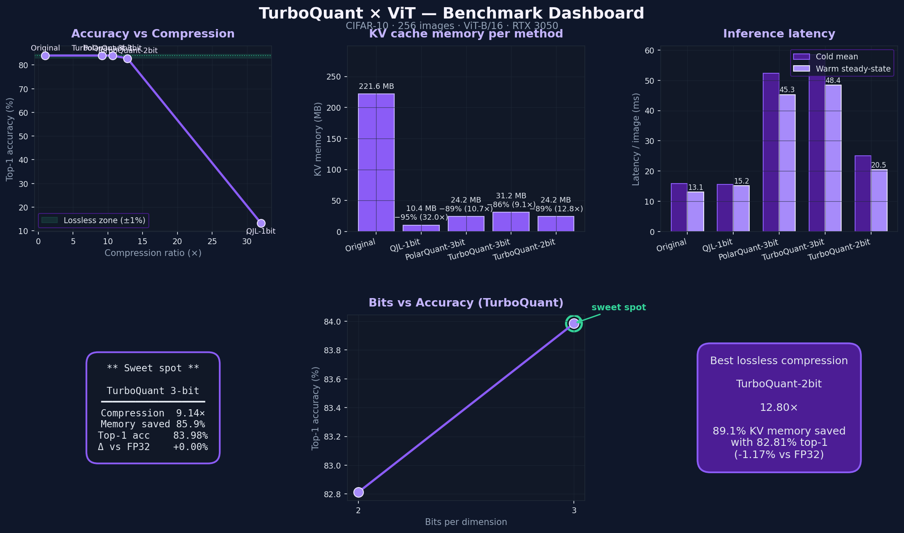

# TurboQuant × ViT — KV Cache Compression for Vision Transformers


> **First open-source application of *TurboQuant* (Google Research, ICLR 2026) to Vision Transformers.**
> The original paper evaluates KV-cache compression on LLMs only. This repo
> ports the QJL + PolarQuant machinery to ViT-B/16 self-attention via PyTorch
> hooks — **no retraining, no weight changes** — and ships an interactive
> Streamlit dashboard that benchmarks four compression schemes side-by-side on
> CIFAR-10.



---

## 🚀 Why this matters

- **Up to ~12.8× smaller KV cache** (89 % memory saved) at the bit-widths where ViT remains lossless.
- **Lossless top-1 accuracy** at 3-bit TurboQuant — 83.98 % (matches FP32) on CIFAR-10.
- **Drop-in inference**: a context manager swaps in compressed attention; weights stay frozen.
- **Enables ViT inference on memory-constrained GPUs** — long-sequence / large-batch settings where the K/V cache is the binding constraint.
- **Bridges LLM research → vision research**: the same compressor algorithms used for billion-parameter language models, validated on patch-token attention.

---

## ⚡ Quick demo

```bash
git clone https://github.com/saurabhshreni-cmyk/turboquant_vit.git
cd turboquant_vit
pip install -r requirements.txt
streamlit run app.py
```

Then open [http://localhost:8501](http://localhost:8501) and click **Benchmark Dashboard → ▶ Run full benchmark**.

CIFAR-10 downloads to `./data/` automatically on first launch (gitignored).

---

## 📊 Results — CIFAR-10, 256 test images, ViT-B/16, RTX 3050

Numbers below are taken straight from `assets/dashboard.png` (commit-pinned run, batch 16, single GPU).
Reproduce with **Run full benchmark** in the dashboard.

| Method            | Bits | Top-1 acc      | KV memory   | Compression | Memory saved | Warm latency |
|-------------------|-----:|---------------:|------------:|------------:|-------------:|-------------:|
| **Original ViT**  | 32   | 83.98 %        | 221.63 MB   | 1.00×       | —            | 13.1 ms      |
| QJL               |  1   | 13.28 %        |  10.39 MB   | 32.00×      | 95.3 %       | 15.2 ms      |
| **PolarQuant**    |  3   | **83.98 %**    |  24.24 MB   | **10.67×**  | 89.1 %       | 45.3 ms      |
| **TurboQuant**    |  3   | **83.98 %**    |  31.17 MB   |  9.14×      | 85.9 %       | 48.4 ms      |
| **TurboQuant**    |  2   | 82.81 %        |  24.24 MB   | **12.80×**  | 89.1 %       | 20.5 ms      |

> **🔥 Sweet spot — TurboQuant 3-bit:** 9.14× compression, 85.9 % memory saved, **0.00 % top-1 loss**.
> Need more compression? **TurboQuant 2-bit** gives 12.8× at only −1.17 % accuracy.

QJL-1bit is included as a reference for a "compression-only, accuracy-blind" baseline — it shows why bias correction matters: pure sign-sketches destroy attention geometry.

---

## ⚙️ Engineering challenges solved

| Issue | Symptom | Root cause | Fix |
|---|---|---|---|
| **Cold-start latency ~40 s** | Every TurboQuant inference rebuilt 12 layers × {K, V} = 24 compressors from scratch (Lloyd-Max codebook over 200 k samples × 60 iters per compressor). | The closure that cached compressors lived inside the `_make_compressed_forward` factory and was recreated on every `compressed_vit` install. | Process-wide `_COMPRESSOR_CACHE` keyed by `(method, dim, bits, seed)`. Codebooks build **once per process**; subsequent calls are instant. |
| **CPU/CUDA tensor mismatch** | `RuntimeError: tensors on different devices` when computing attention distortion. | Reference attention was forced to CPU but compared against a CUDA tensor inside `torch.linalg.norm(a - b)`. | `frobenius_distortion` now aligns devices/dtypes; reference attention stays on the model's device; `model_device(model)` helper everywhere. |
| **Attention Visualizer KeyError: 11** | UI crash when a layer was missing from one method's capture. | Slider derived `n_layers` from one method, looked up by raw int key in others. | Intersect layer keys across all methods, clamp head index per layer, wrap each capture in `try/except` with user-visible fallback. |
| **Brittle model loading** | App crashed on offline / slow networks. | Single HuggingFace download path. | Three-tier loader: HF cache → HF download with wall-clock timeout → torchvision `vit_b_16` fallback that adapts the attention modules so the same hooks still work. |
| **CIFAR-10 download blocking the UI** | Streamlit froze on cold cache. | Synchronous downloads with no fallback. | Non-blocking loader with timeout and a synthetic-image fallback so the UI is always interactive. |
| **Latency reporting bias** | First-batch CUDA warmup inflated mean. | Single average over all batches. | Report **cold mean** *and* **warm steady-state** (first batch dropped). |

---

## 🧠 Methods

| Method | Bits/dim | What it does |
|---|---:|---|
| **Original ViT** | 32 | Baseline FP32 K/V — reference for accuracy and memory. |
| **QJL** *(Quantized Johnson–Lindenstrauss)* | 1 | Project K/V through a Gaussian sketch `R ∈ ℝ^{k×d}` and store only `sign(Rx)`. Inner-product estimator is unbiased but variance is high at 1-bit. |
| **PolarQuant** | b | Random orthogonal rotation → unit-sphere normalize → Lloyd-Max scalar quantization (codebook fit to the marginal of a uniformly-random unit vector). MSE-optimal main pass. |
| **TurboQuant** | b + ½ | PolarQuant for the main pass + a 1-bit QJL sketch on the residual `r = x − x̂` for unbiased inner-product correction. Effective rate ≈ 3.5 bits/dim at b = 3. |

All compressors are implemented from scratch in NumPy + PyTorch — see [`turbo_compressor.py`](turbo_compressor.py).

---

## 🏗️ Architecture

```
                     ┌─────────────────────────────────────────┐
                     │            ViT-B/16 (frozen)            │
                     │                                         │
   image  ──►  patch ──►  embed ──►  Q,K,V ──►  attention ──► logits
   224x224     16x16              ▲   │
                                  │   ▼
                                  │  ┌────────────────────┐
                                  │  │ TurboQuant compress │  ◄── PyTorch hook
                                  │  │  (PolarQuant + QJL) │
                                  │  └────────────────────┘
                                  │   │
                                  └───┘   K,V replaced in-flight
```

The hook in [`vit_hook.py`](vit_hook.py) monkey-patches `ViTSelfAttention.forward`,
intercepts K/V after the linear projections, compresses + decompresses them
**once per layer per forward pass** (vectorized across heads, no Python loop),
then computes scaled-dot-product attention against the reconstructed tensors.

---

## 🖥️ Streamlit app

Five pages:

1. **Home** — pipeline overview and motivation.
2. **Try It Live** — pick a CIFAR-10 sample (or upload), pick method/bits, see side-by-side prediction, attention map, latency, memory.
3. **Benchmark Dashboard** — run all four methods on N images: KPI strip, accuracy-vs-compression curve, memory-savings bar (with %/×), grouped cold/warm latency bars, bits-vs-accuracy sweep with 3-bit sweet-spot highlight, CSV export.
4. **Attention Visualizer** — pick layer + head, compare attention heatmaps across all four methods. Robust to missing layers (warns + falls back instead of crashing).
5. **How It Works** — step-by-step explanation with LaTeX equations and a code snippet of the hook.

---

## 📁 Repo structure

```
turboquant_vit/
├── app.py                    # Streamlit UI (5 pages)
├── compressed_attention.py   # Context manager wrapping the hook
├── vit_hook.py               # Monkey-patched ViTSelfAttention forward
├── turbo_compressor.py       # QJL, PolarQuant, TurboQuant (from scratch)
├── evaluator.py              # Benchmark runner + metric derivation
├── visualizer.py             # Plotly charts (purple-themed)
├── data_loader.py            # CIFAR-10 loader with timeout + fallback
├── model_loader.py           # HF → torchvision fallback ViT loader
├── utils.py                  # Device helpers, distortion, formatting
├── assets/
│   ├── dashboard.png         # Static dashboard preview (in README)
│   ├── render_dashboard.py   # Rebuilds dashboard.png from results
│   └── generate_banner.py    # Programmatic banner for the home page
├── requirements.txt
├── LICENSE
└── README.md
```

---

## 🛠️ Installation

```bash
# Python 3.10+
pip install -r requirements.txt
streamlit run app.py
```

Tested on **RTX 3050 4 GB / CUDA 11.8 / torch 2.5.1**. CPU-only fallback works (slower).
All forward passes use `torch.no_grad()`; default batch size 16.

---

## 🧪 Reproducing the benchmark numbers

The dashboard image and the table above were generated by running:

```bash
python _bench_run.py                # writes _bench_results.json (gitignored)
python assets/render_dashboard.py   # writes assets/dashboard.png
```

`_bench_run.py` and `assets/render_dashboard.py` are committed so anyone can
regenerate the dashboard image; the intermediate `_bench_results.json` is
gitignored.

---

## 📚 Citation

If you use this work, please cite the original TurboQuant paper:

```bibtex
@inproceedings{turboquant2026,
  title     = {TurboQuant: Online Vector Quantization with Near-optimal Distortion Rate},
  author    = {Google Research},
  booktitle = {International Conference on Learning Representations (ICLR)},
  year      = {2026}
}
```

---

## License

Released under the [MIT License](LICENSE) — © 2026 Saurabh Shreni.
